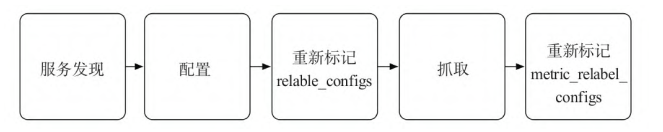

[配置官网文档](https://prometheus.io/docs/prometheus/latest/configuration/configuration/)
# prometheus.yml结构
```yaml
global:
  # How frequently to scrape targets by default.
  [ scrape_interval: <duration> | default = 1m ]

  # How long until a scrape request times out.
  [ scrape_timeout: <duration> | default = 10s ]

  # How frequently to evaluate rules.
  [ evaluation_interval: <duration> | default = 1m ]

  # The labels to add to any time series or alerts when communicating with
  # external systems (federation, remote storage, Alertmanager).
  external_labels:
    [ <labelname>: <labelvalue> ... ]

  # File to which PromQL queries are logged.
  # Reloading the configuration will reopen the file.
  [ query_log_file: <string> ]

# Rule files specifies a list of globs. Rules and alerts are read from
# all matching files.
rule_files:
  [ - <filepath_glob> ... ]

# A list of scrape configurations.
scrape_configs:
  [ - <scrape_config> ... ]

# Alerting specifies settings related to the Alertmanager.
alerting:
  alert_relabel_configs:
    [ - <relabel_config> ... ]
  alertmanagers:
    [ - <alertmanager_config> ... ]

# Settings related to the remote write feature.
remote_write:
  [ - <remote_write> ... ]

# Settings related to the remote read feature.
remote_read:
  [ - <remote_read> ... ]

# Storage related settings that are runtime reloadable.
storage:
  [ tsdb: <tsdb> ]
  [ exemplars: <exemplars> ]

# Configures exporting traces.
tracing:
  [ <tracing_config> ]
```
# gloabl（全局配置）
* scrape_interval:抓取数据的时间间隔,默认1m，建议15s
* scrape_timeout:抓取超时时间，默认10s，建议15s
* evaluation_interval:评估计算时间，主要和报警搭配，prometheus在这个指定时间能对报警规则和数据进行一次计算，看是否需要触发报警
举例配置：
```yaml
global:
  scrape_interval: 15s
  evaluation_interval: 15s
```
# scrape_configs（指标抓举配置）
```yaml
# The job name assigned to scraped metrics by default.
job_name: <job_name>
# How frequently to scrape targets from this job.
[ scrape_interval: <duration> | default = <global_config.scrape_interval> ]
# Per-scrape timeout when scraping this job.
[ scrape_timeout: <duration> | default = <global_config.scrape_timeout> ]
# The HTTP resource path on which to fetch metrics from targets.
[ metrics_path: <path> | default = /metrics ]
static_configs:
  [ - <static_config> ... ]
# List of target relabel configurations.
relabel_configs:
  [ - <relabel_config> ... ]
# List of metric relabel configurations.
metric_relabel_configs:
  [ - <relabel_config> ... ]
```
## 抓取指标基本配置
jobname: 抓取任务名称
static_configs:静态配置指标
static_configs.targets:静态抓取指标的ip地址，可以配多个
举例：如下配置了node_exporter和docker的抓取任务配置
```yaml
scrape_configs:
  - job_name: 'node_export'
    static_configs:
     - targets: ['192.168.157.128:9100','192.168.157.129:9100']
  - job_name: 'docker'
    static_configs: 
     - targets: ['192.168.157.128:8080']
```
如果想收集指定参数，而不是想exporter抓取全部参数可以假如params参数
```yaml
scrape_configs:
  - job_name: 'node_export'
    static_configs:
     - targets: ['192.168.157.128:9100','192.168.157.129:9100']
     params:
       collect[]:
          - cpu
          - meminfo
```
## 指标自定义
### 指标修改
relabel_configs和metric_relabel_configs都是用来对指标进行修改或者过滤的。二者的区别在于作用对象不同：
* relabel_configs 作用于抓取的所有指标，即抓取到的原始指标。可以用于重命名标签，过滤掉不需要的指标等。例如，可以使用 relabel_configs 把指标的 instance 标签中的 IP 地址替换成主机名。
* metric_relabel_configs 作用于处理过的指标，即已经经过记录规则、处理规则、聚合等处理后的指标。可以用于对指标的值进行修改，例如对指标进行数学运算、对指标进行比较判断等。同时，也可以使用 metric_relabel_configs 重新定义指标的名称和标签。
假设我们有一个应用程序，使用了 Prometheus 的 client 库来暴露一些自定义指标，如下：
my_custom_metric{instance="10.0.0.1:8080", app="myapp"} 42
现在，我们想要修改这个指标的标签，把 app 标签重命名为 application，同时去掉 instance 标签中的端口号，可以使用 relabel_configs 来完成：
```yaml
relabel_configs:
  - source_labels: [instance]
    regex: (.*):\d+
    replacement: $1
    target_label: instance
  - source_labels: [app]
    target_label: application
```
经过上述配置后，我们得到的指标将变成：
my_custom_metric{instance="10.0.0.1", application="myapp"} 42

如果我们想要对指标的值进行修改，例如计算出平均值，可以使用 metric_relabel_configs 来完成：
```yaml
metric_relabel_configs:
  - source_labels: [my_custom_metric]
    regex: (.+)
    target_label: my_custom_metric_avg
    replacement: avg($1)

```
经过上述配置后，我们得到的指标将变成：
my_custom_metric{instance="10.0.0.1", application="myapp"} 42
my_custom_metric_avg{instance="10.0.0.1", application="myapp"} 42
这个新的指标 my_custom_metric_avg 的值为原指标的平均值。可以看到，通过 metric_relabel_configs，我们对指标的值进行了修改，并生成了一个新的指标。

$1 是一个正则表达式中的特殊字符，表示正则表达式中的第一个捕获组。在Prometheus的配置文件中，它可以用于匹配和提取指标标签中的信息，以便于重写或者标记该指标。例如：
```yaml
- source_labels: [__name__]
  regex: my_metric_(.*)
  target_label: my_custom_label
  replacement: $1
```
这个配置将匹配所有名称以 "my_metric_" 开头的指标，提取该指标名称中的任何内容，并将其存储在 "my_custom_label" 标签中。 "replacement" 属性中的 "$1" 将被该捕获组的值替换，以便于将捕获组的值作为标签值使用。
### 自定义收集指标
如果您只想让 Prometheus 收集部分 node_exporter 采集的指标，可以使用 Prometheus 的 relabeling 功能来进行过滤。
```yaml
scrape_configs:
  - job_name: 'node'
    static_configs:
      - targets: ['node-exporter:9100']
    metrics_path: /metrics
    relabel_configs:
      - source_labels: [__name__]
        regex: 'node_cpu.*|node_load.*'
        action: keep
      - source_labels: [__name__]
        regex: 'node_.*_bytes|node_.*_bytes_total'
        action: keep
```
在上面的配置中，我们使用 relabel_configs 属性，对采集到的指标进行了两次过滤。第一次过滤使用了正则表达式 node_cpu.*|node_load.*，它将保留所有名称以 node_cpu 或 node_load 开头的指标。第二次过滤使用了正则表达式 node_.*_bytes|node_.*_bytes_total，它将保留所有名称以 node_ 开头、以 _bytes 或 _bytes_total 结尾的指标。
可以根据自己的需要，修改这些正则表达式，来选择要保留的指标。如果您想过滤掉某些指标，可以将 action 属性设置为 drop。
注：relabel_configs和metric_relabel_configs的区别
metric_relabel_configs 中的 action:drop 和 relabel_configs 中的 action:drop 都可以用来删除指标，但是它们的作用范围不同。
metric_relabel_configs 可以在 metrics 数据被收集之后对指标进行重命名、修改、删除等操作，而 relabel_configs 则可以在 metrics 数据被收集之前对标签进行处理，例如修改标签名称、值、添加新标签等。
因此，metric_relabel_configs 的 action:drop 可以用于在 metrics 数据被收集之后删除指标，而 relabel_configs 的 action:drop 通常用于在 metrics 数据被收集之前过滤掉不需要的标签或指标。


# rule_files（告警规则配置）