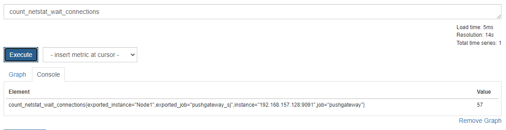

# pushgateway作用
pushgateway**没有数据抓取功能，它只能接收别的工具采集来的数据**（和node_exporter区别）类似一个代理，为一些脚本提供给向prometheus传递数据的代理。
注意：也可以使用node_exporter中的textfile向prometheus传递自采集数据

# pushgateway使用
## 下载
```shell
ip=192.168.0.233:7890
set http_proxy=$ip
set https_proxy=$ip
wget https://github.com/prometheus/pushgateway/releases/download/v1.5.1/pushgateway-1.5.1.linux-amd64.tar.gz
```
## 解压
```shell
tar -zxvf pushgateway-1.5.1.linux-amd64.tar.gz
cp pushgateway-1.5.1.linux-amd64/pushgateway /usr/local/bin/
pushgateway --version
```

## 配置
pushgateway默认不需要任何配置，网关默认在端口9091上运行， 可以使用--web.listen-address参数来覆盖地址和端口。
1. 启动
```shell
#直接运行，默认绑定本机9091
pushgateway
#指定端口运行
pushgateway --web.listen-address="0.0.0.0:9092"
```
2. pushgateway自身指标
默认情况下， 网关将所有指标存储在内存中。 这意味着如果网关停止或重新启动， 那么你将丢失
内存中的所有指标。 可以通过指定--persistence.file参数将指标持久存储于磁盘路径。
默认情况下， 文件每五分钟持久化写入一次， 但你可以使用--persistence.interval参数覆盖它
```shell
pushgateway --persistence.file="/tmp/pushgateway"
```
注：成功运行后可以访问对应的端口的webui

# 使用脚本向pushgateway发送指标
如下脚本实现了监控linux下的，wait_connection个数，并将该指标推向了pushgateway
```shell
#!/bin/bash
hostname=`hostname`
echo "hostname=$hostname"
for ((;;))
do
 #监控指标
 count_netstat_wait_connections=$( netstat -anp | grep -ic wait )
 echo "count_netstat_wait_connections=$count_netstat_wait_connections"
 # 通过echo将key value（echo "count_netstat_wait_connections $count_netstat_wait_connections"）通过管道的方式传递给curl，curl采用post方法向pushgateway传递数据
 echo "count_netstat_wait_connections $count_netstat_wait_connections" | curl --data-binary @- http://192.168.157.128:9091/metrics/job/pushgateway_sj/instance/$hostname
 sleep 1
done
```
URL分析：
* pushgateway地址
http://192.168.157.128:9091/metrics/
* job/pushgateway_sj
Restful的路径参数，job/pushgateway_sj对应标签内exported_job=pushgateway_sj
* instance/$hostname
Restful的路径参数，hostname是本机名称，instance/$hostname对应标签内exported_instance="Node1"
