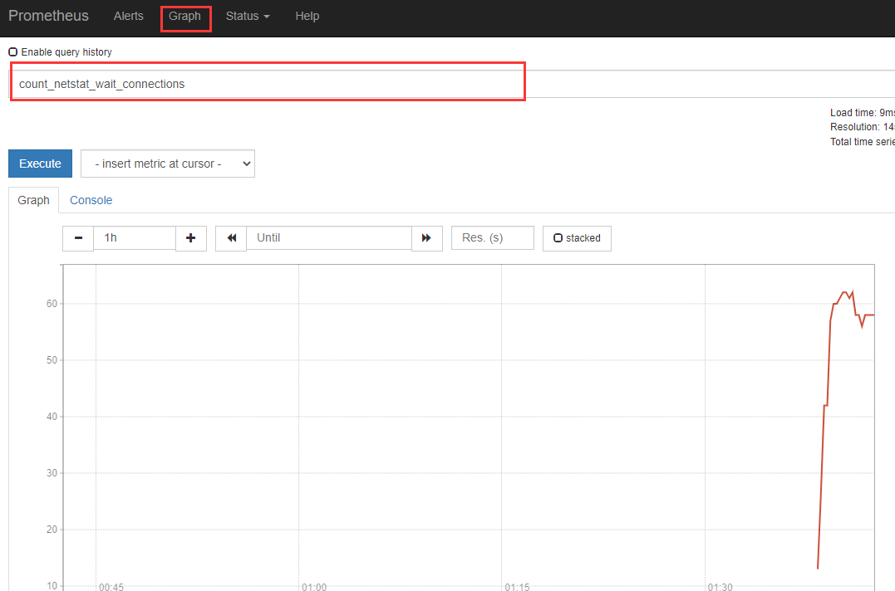
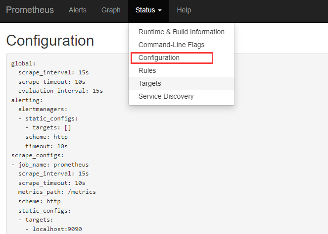
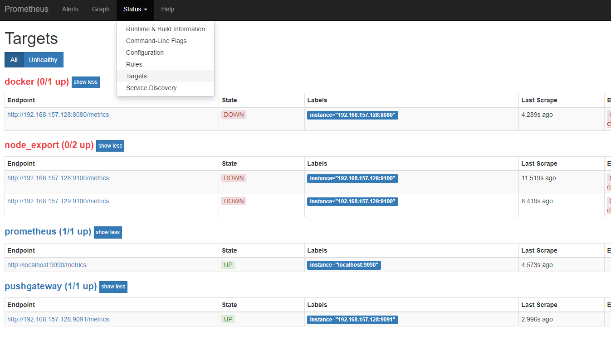
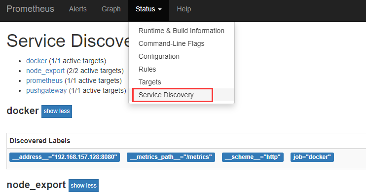

# 访问WebUi
1. 确保正确启动prometheus服务
2. 访问prometheus服务节点的9090端口

# WebUi主要功能介绍
## 1.graph
graph可以使用promql，来查询监控到的数据，并将数据可视化展现

## 2.status
### 2.1 Configuration
Configuration对应着prometheus.yml中的配置内容

### 2.2 Targets
targets显示监控的目标状况，如果监控目标正常会显示up，否则会显示down

### 2.3 Service Discovery
服务发现和targets显示的内容相识，显示待抓取的服务指标
