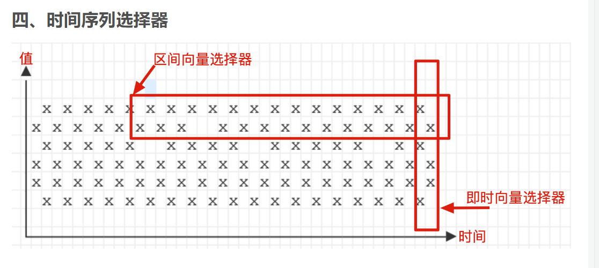

# 数据变量量类型
## Instant vector
一组时间序列，每个时间序列包含一个样本，所有样本共享相同的时间戳。
## Range vector
一组时间序列，其中包含每个时间序列随时间变化的一系列数据点。
Instant vector与Range vector的区别

注意：在prometheus的webui绘图要求，promql查询结果是instant vector变量
## Scalar
一个浮点型的数据值。
## String
一个字符串，当前没有使用到。
