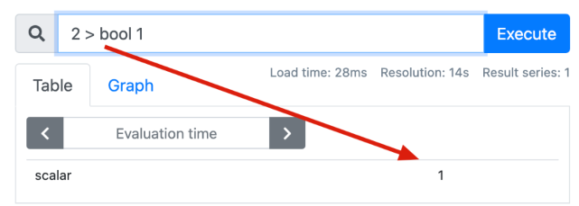
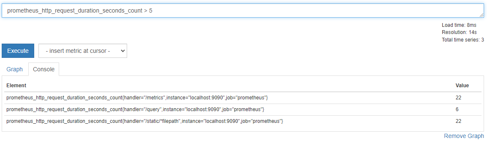
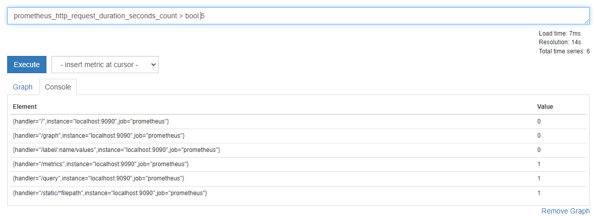
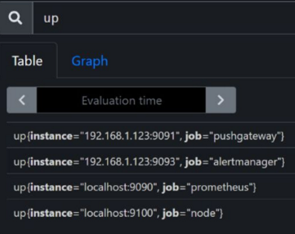
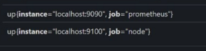
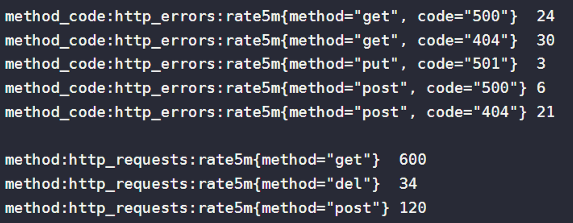
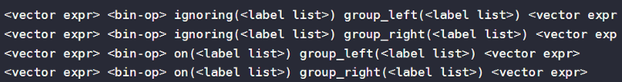

# 匹配规则
## 匹配基本命令格式
* 指标名称{标签条件}[时间区间]
* {标签条件}[时间区间]
* 指标名称[时间区间]
注意：[时间区间]不是必须，指标名称和{标签条件}必须有一个
## 示例
* up

* 绘图实际上花的是时间范围数据

* http://192.168.157.128:9090/api/v1/query?query=up
可以看出如果不指定[时间区间]，返回的就是最近的一次指标数据
```json
{
  "status": "success",
  "data": {
    "resultType": "vector",
    "result": [
      {
        "metric": {
          "__name__": "up",
          "instance": "192.168.157.128:8080",
          "job": "docker"
        },
        "value": [
          1679021859.078,
          "0"
        ]
      },
      {
        "metric": {
          "__name__": "up",
          "instance": "192.168.157.128:9091",
          "job": "pushgateway"
        },
        "value": [
          1679021859.078,
          "0"
        ]
      },
      {
        "metric": {
          "__name__": "up",
          "instance": "192.168.157.128:9100",
          "job": "node_export"
        },
        "value": [
          1679021859.078,
          "0"
        ]
      },
      {
        "metric": {
          "__name__": "up",
          "instance": "192.168.157.129:9100",
          "job": "node_export"
        },
        "value": [
          1679021859.078,
          "0"
        ]
      },
      {
        "metric": {
          "__name__": "up",
          "instance": "localhost:9090",
          "job": "prometheus"
        },
        "value": [
          1679021859.078,
          "1"
        ]
      }
    ]
  }
}
```

## 标签条件
1. = 
精确的匹配给定的标签值
* 例：up{job="prometheus"}
2. != 
* 例：不匹配给定的标签值
up{job!="prometheus"}
3. =~
正则表达式匹配给定的标签值
* 例： up{job=~"pro.*"}
4. !~
不匹配正则表格式给定的标签值
* 例： up{job!~"pro.*"}
5. 查询不存在某标签的指标
如查询不存在env标签的up
* 例：up{env="""}

# 时间区间
## 单位
ms(毫秒)、s(秒)、m(分钟)、h(小时)、d(天)、w(周)、y(年)
如:up[5m],查询现在到过去五分钟所有采集点数据
## 偏移量
默认情况下，即时向量和区间向量选择器都是以当前时间为准，但是偏移量修改器offset可以修改该基准偏移量选择器是紧跟在表达式之后使用offset来指定的。
* 表示获取指标名称prometheus_http_requests_total的所有时间序列在过去1分钟的即时样本。
prometheus_ http requests total offset 1m
* 表示获取指标名称prometheus_http_requests_total的所有时间序列在距离此刻1分钟之前的5分钟之内的样本。
prometheus_ http_ requests_ total[5m] offset 1m
# 算数运算符
1. 支持运算符号
+(加)、-(减)、*(乘)、/(除)、%(取模)、^(幂等)
2. 支持的运算
二元运算操作符可以在scalar/scalar(标量/标量)、vector/scalar(向量/标量)、和vector/vector(向量/向量)之间运算。
* 在两个标量之间运算，得到的结果也是一个标量。
注：两个标量之间的布尔运算，必须要提供一个bool修饰符，运算的结果会产生一个新的标量，值为0(假)或1(真)。

* 在即时向量和标量之间运算，将运算符应用于这个向量中的每个数据样本的值。


* 在两个即时向量之间运算，运算符会依次找到与左边向量元素匹配（**标签完全一致**)的右边向量元素进行运算，如果没找到匹配元素，则直接丢弃。同时新的时间序列将不会包含指标名称。
注意：标签一致是指的{}里的内容一致
# 逻辑运算符
1. 支持的运算
and、or、unless

2. and
A and B => C,C的内容是A和B的交集，交集要求标签完全一致
up{instance!="192.168.1.123:9091"} and up{job!="alertmanager"}

3. or
A or B => C,C的内容是A+（A-B）
4. unless
A unless B =>C,假设A and B => D,C=A-D

# 向量匹配
## 匹配规则
匹配行为有两种基本类型:一对一、一对多、多对一。
注意：
1. 向量之间的匹配是在2个即时向量之间进行匹配，不能是区间向量。
2. 两个向量要匹配,要求有完全相同的标签（标签名和值都要相同，如两个标签都有{code="200"},k和v都要相同），或者使用on或者ignoring后能匹配上
3. 使用on指定使用那个标签相同，就认为两个向量匹配上。
4. 使用ignoring忽略某些标签相同，其他标签一致就认为匹配上。
## 举例
### 一对一

* 式子：method_code:http_errors:rate5m{code="500"} / ignoring(code) method:http_requests:rate5m
* 结果：{method=“post”} 0.04
* 分析：method_code:http_errors:rate5m{code="500"}的条件只有1条，忽略code进行匹配后，右边method=get只有一条
所以进行的运算是method_code:http_errors:rate5m{method="get", code="500"} / method:http_requests:rate5m{method="get"}
即：24/600=0.04
* 注意：ignoring()或者on()里面可以写多个标签，不只是一个
### 一对多
一对多和多对一匹配指的是一的一侧的每个向量元素可以与多侧的多个元素进行匹配必须使用group_left或 group_right修饰符显式请求，其中left/right确定哪个向量具有更高的基数。


