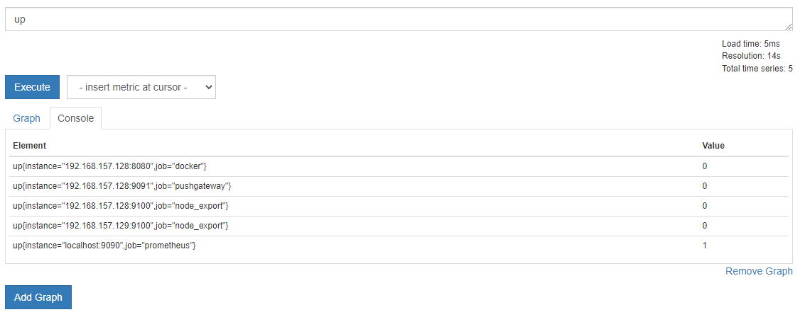
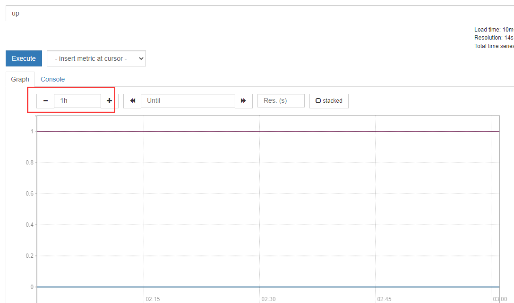

# 匹配规则
## 匹配基本命令格式
* 指标名称{标签条件}[时间区间]
* {标签条件}[时间区间]
* 指标名称[时间区间]
注意：[时间区间]不是必须，指标名称和{标签条件}必须有一个
## 示例
* up

* 绘图实际上花的是时间范围数据

* http://192.168.157.128:9090/api/v1/query?query=up
可以看出如果不指定[时间区间]，返回的就是最近的一次指标数据
```json
{
  "status": "success",
  "data": {
    "resultType": "vector",
    "result": [
      {
        "metric": {
          "__name__": "up",
          "instance": "192.168.157.128:8080",
          "job": "docker"
        },
        "value": [
          1679021859.078,
          "0"
        ]
      },
      {
        "metric": {
          "__name__": "up",
          "instance": "192.168.157.128:9091",
          "job": "pushgateway"
        },
        "value": [
          1679021859.078,
          "0"
        ]
      },
      {
        "metric": {
          "__name__": "up",
          "instance": "192.168.157.128:9100",
          "job": "node_export"
        },
        "value": [
          1679021859.078,
          "0"
        ]
      },
      {
        "metric": {
          "__name__": "up",
          "instance": "192.168.157.129:9100",
          "job": "node_export"
        },
        "value": [
          1679021859.078,
          "0"
        ]
      },
      {
        "metric": {
          "__name__": "up",
          "instance": "localhost:9090",
          "job": "prometheus"
        },
        "value": [
          1679021859.078,
          "1"
        ]
      }
    ]
  }
}
```

## 标签条件
1. = 
精确的匹配给定的标签值
* 例：up{job="prometheus"}
2. != 
* 例：不匹配给定的标签值
up{job!="prometheus"}
3. =~
正则表达式匹配给定的标签值
* 例： up{job=~"pro.*"}
4. !~
不匹配正则表格式给定的标签值
* 例： up{job!~"pro.*"}
5. 查询不存在某标签的指标
如查询不存在env标签的up
* 例：up{env="""}

# 时间区间
## 单位
ms(毫秒)、s(秒)、m(分钟)、h(小时)、d(天)、w(周)、y(年)
如:up[5m],查询现在到过去五分钟所有采集点数据
## 偏移量
默认情况下，即时向量和区间向量选择器都是以当前时间为准，但是偏移量修改器offset可以修改该基准偏移量选择器是紧跟在表达式之后使用offset来指定的。
* 表示获取指标名称prometheus_http_requests_total的所有时间序列在过去1分钟的即时样本。
prometheus_ http requests total offset 1m
* 表示获取指标名称prometheus_http_requests_total的所有时间序列在距离此刻1分钟之前的5分钟之内的样本。
prometheus_ http_ requests_ total[5m] offset 1m

  
# 运算符